# Healthy Club - Architecture Documentation

## Table of Contents
1. [Project Overview](#project-overview)
2. [Technology Stack](#technology-stack)
3. [Database Schema](#database-schema)
4. [Authentication & Authorization](#authentication--authorization)
5. [API Endpoints](#api-endpoints)
6. [Features](#features)
7. [WhatsApp Integration](#whatsapp-integration)
8. [Performance & Caching](#performance--caching)
9. [Security](#security)
10. [Deployment](#deployment)

---

## Project Overview

**Healthy Club** is a meal subscription service platform built for Bahrain market. It allows customers to subscribe to meal delivery plans, manages daily order generation, driver assignments, and automated WhatsApp notifications.

### Core Capabilities
- Multi-tier meal packages (Normal, Keto, Vegetarian, Special)
- Flexible subscription options (meals per day, days per week/month)
- Automated daily order generation from active subscriptions
- Driver assignment with area-based load balancing
- WhatsApp notifications via WAHA (WhatsApp HTTP API)
- Role-based access control (Customer, Driver, Admin)

---

## Technology Stack

### Frontend
- **Framework**: Next.js 16.1.1 (App Router)
- **React**: 19.2.3
- **TypeScript**: 5.x
- **UI Components**: shadcn/ui + Radix UI
- **Styling**: Tailwind CSS 4.x
- **Form Handling**: React Hook Form + Zod validation
- **Date Utilities**: date-fns 4.1.0
- **Carousel**: Embla Carousel 8.6.0
- **Themes**: next-themes 0.4.6
- **Notifications**: Sonner 2.0.7

### Backend
- **Runtime**: Next.js API Routes (Server Components + Route Handlers)
- **Database**: PostgreSQL (via Supabase)
- **ORM**: Supabase Client (@supabase/supabase-js 2.89.0)
- **Auth**: Supabase Auth with Google OAuth
- **Session Management**: @supabase/ssr 0.8.0

### External Services
- **Database & Auth**: Supabase (PostgreSQL + Auth)
- **WhatsApp API**: WAHA (WhatsApp HTTP API) - Self-hosted
- **Messaging**: WhatsApp Business API via WAHA

### Development
- **Package Manager**: npm
- **Linting**: ESLint 9.x
- **Type Checking**: TypeScript 5.x
- **CSS PostProcessing**: @tailwindcss/postcss 4.x

---

## Database Schema

### Entity Relationship Diagram


### Key Tables

#### 1. profiles
Extends Supabase `auth.users` with application-specific profile data.

```sql
CREATE TABLE profiles (
  id UUID PRIMARY KEY REFERENCES auth.users(id) ON DELETE CASCADE,
  full_name TEXT NOT NULL,
  phone TEXT NOT NULL,
  role TEXT NOT NULL CHECK (role IN ('customer', 'driver', 'admin')) DEFAULT 'customer',
  address TEXT,
  area TEXT,
  building TEXT,
  flat_number TEXT,
  created_at TIMESTAMPTZ NOT NULL DEFAULT NOW(),
  updated_at TIMESTAMPTZ NOT NULL DEFAULT NOW()
);
```

**Indexes:**
- `idx_profiles_role` - For role-based queries
- `idx_profiles_phone` - For phone lookup
- `idx_profiles_area` (filtered) - For customer location queries

#### 2. packages
Meal package types with base pricing.

```sql
CREATE TABLE packages (
  id UUID PRIMARY KEY DEFAULT uuid_generate_v4(),
  name TEXT NOT NULL UNIQUE CHECK (name IN ('normal', 'keto', 'vegetarian', 'special')),
  description TEXT,
  image_url TEXT,
  base_price DECIMAL(10,2) NOT NULL CHECK (base_price >= 0),
  active BOOLEAN NOT NULL DEFAULT true,
  created_at TIMESTAMPTZ NOT NULL DEFAULT NOW()
);
```

**Seed Data:**
- Normal: BD 120.00 - Balanced meals
- Keto: BD 150.00 - Low-carb, high-fat
- Vegetarian: BD 110.00 - Plant-based
- Special: BD 180.00 - Customized dietary needs

#### 3. package_options
Configurable subscription tiers per package.

```sql
CREATE TABLE package_options (
  id UUID PRIMARY KEY DEFAULT uuid_generate_v4(),
  package_id UUID NOT NULL REFERENCES packages(id) ON DELETE CASCADE,
  meals_per_day INTEGER NOT NULL CHECK (meals_per_day IN (1, 2, 3)),
  days_per_month INTEGER NOT NULL CHECK (days_per_month IN (20, 24, 26)),
  days_per_week INTEGER NOT NULL CHECK (days_per_week IN (5, 6, 7)),
  price_modifier DECIMAL(10,2) NOT NULL DEFAULT 0,
  active BOOLEAN NOT NULL DEFAULT true,
  created_at TIMESTAMPTZ NOT NULL DEFAULT NOW(),
  UNIQUE(package_id, meals_per_day, days_per_month, days_per_week)
);
```

**Pricing Logic:**
- `final_price = package.base_price + package_option.price_modifier`
- More meals/days = higher price modifier

#### 4. subscriptions
Customer meal subscriptions.

```sql
CREATE TABLE subscriptions (
  id UUID PRIMARY KEY DEFAULT uuid_generate_v4(),
  user_id UUID NOT NULL REFERENCES profiles(id) ON DELETE CASCADE,
  package_id UUID NOT NULL REFERENCES packages(id) ON DELETE RESTRICT,
  package_option_id UUID NOT NULL REFERENCES package_options(id) ON DELETE RESTRICT,
  start_date DATE NOT NULL,
  end_date DATE NOT NULL,
  selected_days JSONB NOT NULL DEFAULT '[]'::jsonb,
  dietary_restrictions JSONB NOT NULL DEFAULT '{"allergies": [], "exclusions": []}'::jsonb,
  status TEXT NOT NULL CHECK (status IN ('active', 'paused', 'cancelled', 'expired')) DEFAULT 'active',
  total_price DECIMAL(10,2) NOT NULL CHECK (total_price >= 0),
  paid BOOLEAN NOT NULL DEFAULT false,
  created_at TIMESTAMPTZ NOT NULL DEFAULT NOW(),
  updated_at TIMESTAMPTZ NOT NULL DEFAULT NOW(),
  CONSTRAINT end_date_after_start CHECK (end_date > start_date)
);
```

**JSONB Fields:**
- `selected_days`: `["monday", "tuesday", "wednesday", ...]`
- `dietary_restrictions`: `{"allergies": ["nuts"], "exclusions": ["dairy"]}`

#### 5. daily_orders
Generated from active subscriptions for each delivery date.

```sql
CREATE TABLE daily_orders (
  id UUID PRIMARY KEY DEFAULT uuid_generate_v4(),
  subscription_id UUID NOT NULL REFERENCES subscriptions(id) ON DELETE CASCADE,
  driver_id UUID REFERENCES drivers(id) ON DELETE SET NULL,
  delivery_date DATE NOT NULL,
  delivery_time_slot TEXT,
  meal_details JSONB NOT NULL DEFAULT '{}'::jsonb,
  status TEXT NOT NULL CHECK (status IN ('scheduled', 'preparing', 'out_for_delivery', 'delivered', 'cancelled')) DEFAULT 'scheduled',
  delivery_address TEXT NOT NULL,
  driver_notified_at TIMESTAMPTZ,
  delivered_at TIMESTAMPTZ,
  notes TEXT,
  created_at TIMESTAMPTZ NOT NULL DEFAULT NOW(),
  updated_at TIMESTAMPTZ NOT NULL DEFAULT NOW()
);
```

**Indexes:**
- `idx_daily_orders_driver_date` (filtered) - For driver's active deliveries
- `idx_daily_orders_delivery_date` - For date-based queries
- `idx_daily_orders_status` - For status filtering

#### 6. drivers
Driver profiles with location tracking.

```sql
CREATE TABLE drivers (
  id UUID PRIMARY KEY DEFAULT uuid_generate_v4(),
  user_id UUID NOT NULL UNIQUE REFERENCES profiles(id) ON DELETE CASCADE,
  phone TEXT NOT NULL,
  assigned_area TEXT,
  active BOOLEAN NOT NULL DEFAULT true,
  current_lat DECIMAL(10,8),
  current_lng DECIMAL(11,8),
  created_at TIMESTAMPTZ NOT NULL DEFAULT NOW(),
  updated_at TIMESTAMPTZ NOT NULL DEFAULT NOW()
);
```

#### 7. whatsapp_messages
Message log for WhatsApp communications.

```sql
CREATE TABLE whatsapp_messages (
  id UUID PRIMARY KEY DEFAULT uuid_generate_v4(),
  driver_id UUID NOT NULL REFERENCES drivers(id) ON DELETE CASCADE,
  order_id UUID REFERENCES daily_orders(id) ON DELETE SET NULL,
  message_type TEXT NOT NULL CHECK (message_type IN ('order_notification', 'delivery_confirmation', 'reminder')),
  message_content TEXT NOT NULL,
  sent_at TIMESTAMPTZ,
  status TEXT NOT NULL CHECK (status IN ('pending', 'sent', 'delivered', 'read', 'failed')) DEFAULT 'pending',
  response TEXT,
  created_at TIMESTAMPTZ NOT NULL DEFAULT NOW()
);
```

### Database Functions

#### 1. generate_daily_orders(target_date)
Automatically generates daily orders from active subscriptions.

```sql
-- Called by cron job daily at midnight
SELECT * FROM generate_daily_orders('2025-01-02');
```

**Logic:**
1. Get day of week from `target_date`
2. Find all active subscriptions where:
   - `target_date` is between `start_date` and `end_date`
   - `selected_days` JSONB contains the day of week
   - No order exists for this subscription + date
3. Create `daily_orders` record with:
   - Customer's delivery address
   - Meal details from package options
   - Status: `scheduled`

#### 2. auto_assign_driver_to_order(order_uuid)
Assigns driver to an order based on area and load balancing.

```sql
-- Returns assigned driver_id or NULL
SELECT auto_assign_driver_to_order('order-uuid-here');
```

**Algorithm:**
1. Extract customer area from order's subscription
2. Find active drivers assigned to that area
3. Sort by current workload (count of active orders for the day)
4. Assign driver with lowest workload
5. Update order with `driver_id`

### Helper Views

#### active_subscriptions_view
```sql
CREATE VIEW active_subscriptions_view AS
SELECT
  s.id,
  s.user_id,
  p.full_name as customer_name,
  p.phone as customer_phone,
  p.area,
  pkg.name as package_name,
  po.meals_per_day,
  po.days_per_month,
  po.days_per_week,
  s.start_date,
  s.end_date,
  s.selected_days,
  s.dietary_restrictions,
  s.total_price,
  s.paid
FROM subscriptions s
JOIN profiles p ON s.user_id = p.id
JOIN packages pkg ON s.package_id = pkg.id
JOIN package_options po ON s.package_option_id = po.id
WHERE s.status = 'active';
```

#### daily_orders_view
```sql
CREATE VIEW daily_orders_view AS
SELECT
  dor.id,
  dor.delivery_date,
  dor.delivery_time_slot,
  dor.status,
  p.full_name as customer_name,
  p.phone as customer_phone,
  p.area as customer_area,
  dor.delivery_address,
  d.id as driver_id,
  dp.full_name as driver_name,
  d.phone as driver_phone,
  dor.meal_details,
  dor.driver_notified_at,
  dor.delivered_at,
  pkg.name as package_name
FROM daily_orders dor
JOIN subscriptions s ON dor.subscription_id = s.id
JOIN profiles p ON s.user_id = p.id
JOIN packages pkg ON s.package_id = pkg.id
LEFT JOIN drivers d ON dor.driver_id = d.id
LEFT JOIN profiles dp ON d.user_id = dp.id;
```

---

## Authentication & Authorization

### Authentication Flow


### Middleware Protection

**File**: `middleware.ts`

```typescript
// Public routes (no auth required)
const publicRoutes = ['/', '/login', '/register', '/auth/callback'];

// Protected routes with role requirements
const protectedRoutes = {
  '/dashboard': ['customer', 'admin', 'driver'],
  '/admin': ['admin'],
  '/driver': ['driver'],
};
```

**Logic:**
1. Check if user session exists
2. Redirect unauthenticated users to `/login`
3. Fetch user profile to get role
4. Redirect logged-in users away from auth pages
5. Validate role access for protected routes
6. Redirect to appropriate dashboard if role mismatch

### Role-Based Access Control (RBAC)

| Role | Access | Features |
|------|--------|----------|
| **customer** | `/dashboard` | View subscriptions, orders, profile |
| **driver** | `/driver` | View assigned orders, update delivery status, navigate |
| **admin** | `/admin/*` | Manage customers, drivers, subscriptions, orders, packages |

### Row-Level Security (RLS)

All tables have RLS enabled. Sample policies:

```sql
-- Users can only view their own profile
CREATE POLICY "Users can view own profile"
  ON profiles FOR SELECT
  USING (auth.uid() = id);

-- Users can only view their own subscriptions
CREATE POLICY "Users can view own subscriptions"
  ON subscriptions FOR SELECT
  USING (auth.uid() = user_id);

-- Drivers can view their assigned orders
CREATE POLICY "Drivers can view assigned orders"
  ON daily_orders FOR SELECT
  USING (
    EXISTS (
      SELECT 1 FROM drivers
      WHERE id = daily_orders.driver_id
      AND user_id = auth.uid()
    )
  );

-- Admins have full access to all tables
CREATE POLICY "Admins can view all profiles"
  ON profiles FOR SELECT
  USING (
    EXISTS (
      SELECT 1 FROM profiles
      WHERE id = auth.uid() AND role = 'admin'
    )
  );
```

### Session Management

**Client-side**: `lib/supabase.ts`
```typescript
export function createClient() {
  return createBrowserClient(supabaseUrl, supabaseAnonKey);
}
```

**Server-side**: API Routes & Server Components
```typescript
export async function createServerSupabaseClient() {
  const { cookies } = await import('next/headers');
  const cookieStore = await cookies();

  return createServerClient(supabaseUrl, supabaseAnonKey, {
    cookies: {
      getAll() { return cookieStore.getAll(); },
      setAll(cookiesToSet) { /* Set cookies */ }
    }
  });
}
```

---

## API Endpoints

### API Reference Table

| Endpoint | Method | Auth | Role | Description |
|----------|--------|------|------|-------------|
| `/api/subscriptions` | GET | ✓ | customer, admin | Get user's subscriptions |
| `/api/subscriptions` | POST | ✓ | customer | Create new subscription |
| `/api/subscriptions/[id]` | GET | ✓ | customer, admin | Get subscription details |
| `/api/subscriptions/[id]` | PUT | ✓ | customer, admin | Update subscription |
| `/api/subscriptions/[id]` | DELETE | ✓ | customer, admin | Cancel subscription |
| `/api/orders` | GET | ✓ | customer, admin | Get user's orders |
| `/api/orders/notify-driver` | POST | ✓ | admin | Send WhatsApp to driver |
| `/api/driver/orders` | GET | ✓ | driver | Get driver's assigned orders |
| `/api/driver/status` | POST | ✓ | driver | Update order status |
| `/api/profile` | GET | ✓ | all | Get user profile |
| `/api/profile` | PUT | ✓ | all | Update profile |
| `/api/profile/password` | POST | ✓ | all | Change password |
| `/api/whatsapp/send` | POST | ✓ | admin | Send manual WhatsApp message |
| `/api/whatsapp/webhook` | POST | - | - | Receive WhatsApp events (WAHA) |

### Endpoint Details

#### POST `/api/subscriptions`
Create a new subscription.

**Request Body:**
```json
{
  "packageType": "normal",
  "mealsPerDay": 2,
  "daysPerMonth": 24,
  "daysPerWeek": 6,
  "selectedDays": ["monday", "tuesday", "wednesday", "thursday", "friday", "saturday"],
  "dietaryRestrictions": {
    "allergies": ["nuts"],
    "exclusions": ["dairy"]
  },
  "deliveryAddress": {
    "area": "Adliya",
    "block": "338",
    "road": "3803",
    "building": "123",
    "flat": "4B",
    "notes": "Ring doorbell twice",
    "preferredTimeSlot": "Morning 6-9AM"
  },
  "startDate": "2025-01-15",
  "total_price": 160.00
}
```

**Response:**
```json
{
  "success": true,
  "subscriptionId": "uuid-here",
  "message": "Subscription created successfully"
}
```

#### GET `/api/driver/orders`
Get driver's assigned orders.

**Query Parameters:**
- `status`: Filter by status (scheduled, preparing, out_for_delivery, delivered)
- `date`: Filter by delivery date (YYYY-MM-DD)

**Response:**
```json
{
  "orders": [
    {
      "id": "uuid",
      "subscription_id": "uuid",
      "delivery_date": "2025-01-02",
      "delivery_time_slot": "Morning 6-9AM",
      "status": "out_for_delivery",
      "delivery_address": "Adliya, Block 338, Road 3803, Building 123, Flat 4B",
      "meal_details": {
        "meals_per_day": 2,
        "customer_name": "John Doe"
      },
      "driver_notified_at": "2025-01-02T05:30:00Z",
      "customer": {
        "full_name": "John Doe",
        "phone": "+97335123456"
      },
      "package_type": "normal"
    }
  ]
}
```

#### POST `/api/driver/status`
Update order delivery status.

**Request Body:**
```json
{
  "orderId": "uuid",
  "status": "delivered"
}
```

**Response:**
```json
{
  "success": true,
  "message": "Order status updated to delivered"
}
```

#### POST `/api/whatsapp/send`
Send manual WhatsApp message (admin only).

**Request Body:**
```json
{
  "phone": "+97335123456",
  "message": "Your meal is on the way!",
  "orderId": "uuid-optional",
  "buttons": [
    { "id": "1", "text": "Accept" },
    { "id": "2", "text": "Reject" }
  ]
}
```

**Response:**
```json
{
  "success": true,
  "message": "WhatsApp message sent successfully",
  "messageId": "waha-message-id",
  "timestamp": 1704182400000
}
```

---

## Features

### 1. Subscription Management

**Customer Flow:**
1. Browse packages on homepage
2. Select package (Normal, Keto, Vegetarian, Special)
3. Configure options:
   - Meals per day: 1, 2, or 3
   - Days per month: 20, 24, or 26
   - Days per week: 5, 6, or 7
   - Select specific days (Monday-Sunday)
4. Add dietary restrictions (allergies, exclusions)
5. Enter delivery address (area, block, road, building, flat)
6. Choose time slot (Morning 6-9AM / Afternoon 12-3PM)
7. Review and confirm (payment integration pending)
8. Subscription activated

**Admin Capabilities:**
- View all subscriptions
- Filter by status, package, customer
- Pause/resume subscriptions
- Modify subscription details
- Mark as paid

### 2. Daily Order Generation

**Automated Process:**
```typescript
// lib/order-automation.ts
export async function generateDailyOrders(targetDate: Date) {
  // Call database function
  const { data } = await supabase.rpc('generate_daily_orders', {
    target_date: targetDate.toISOString()
  });

  // Auto-assign drivers
  for (const order of data) {
    await supabase.rpc('auto_assign_driver_to_order', {
      order_uuid: order.order_id
    });
  }

  // Notify drivers
  for (const order of data) {
    await notifyDriverOfOrder(order.order_id);
  }
}
```

**Scheduled via:**
- Vercel Cron Jobs (Production)
- Manual trigger in Admin panel
- Database function can be called directly

### 3. Driver Assignment Algorithm

**File**: Database function `auto_assign_driver_to_order()`

**Algorithm:**
1. Extract customer area from order
2. Query active drivers assigned to that area
3. Count active orders for each driver (for that day)
4. Sort drivers by order count (ASC)
5. Assign driver with lowest workload
6. Update order with `driver_id`

**Load Balancing:**
```sql
SELECT d.id INTO assigned_driver_id
FROM drivers d
WHERE d.assigned_area = order_area
  AND d.active = true
ORDER BY (
  SELECT COUNT(*)
  FROM daily_orders do2
  WHERE do2.driver_id = d.id
    AND do2.delivery_date = (SELECT delivery_date FROM daily_orders WHERE id = order_uuid)
    AND do2.status IN ('preparing', 'out_for_delivery')
) ASC
LIMIT 1;
```

### 4. Driver Mobile Interface

**File**: `app/driver/page.tsx`

**Features:**
- Today's delivery list
- Order details (customer, address, meals, time slot)
- Status updates (preparing → out for delivery → delivered)
- Quick actions:
  - Navigate (Google Maps integration)
  - Call customer (tel: link)
  - WhatsApp customer (prefilled message)
- Real-time order count
- Delivery history

**Status Workflow:**
```
scheduled → preparing → out_for_delivery → delivered
           ↓            ↓                  ↓
        cancelled   cancelled         (final)
```

**Driver Utils** (`lib/driver-utils.ts`):
```typescript
// Generate Google Maps navigation URL
generateMapsUrl(address: string): string

// Generate WhatsApp link with prefilled message
generateWhatsAppUrl(phone: string, name?: string, orderId?: string): string

// Generate phone call link
generatePhoneUrl(phone: string): string
```

### 5. Admin Dashboard

**File**: `app/admin/*`

**Modules:**
- **Dashboard**: Overview stats, recent orders, revenue
- **Customers**: List, search, view subscriptions
- **Drivers**: Manage drivers, assign areas, track performance
- **Subscriptions**: View all, filter, manage status
- **Orders**: Daily orders, assign drivers, track deliveries
- **Packages**: Manage meal packages and pricing

**Key Functions:**
- Manually assign/reassign drivers
- Send manual WhatsApp notifications
- Generate daily orders for specific dates
- View order analytics
- Manage package pricing

---

## WhatsApp Integration

### WAHA (WhatsApp HTTP API)

**Official Docs**: https://waha.devlike.pro/

**Setup:**
```bash
# Docker installation
docker run -d \
  --name waha \
  -p 3001:3001 \
  -e WAHA_API_KEY=your-secret-key \
  devlikeapro/waha
```

**Environment Variables:**
```env
WAHA_API_URL=http://localhost:3001
WAHA_SESSION_NAME=default
WAHA_API_KEY=your-secret-key
```

### Message Templates

**File**: `lib/whatsapp-templates.ts`

#### 1. Driver Order Notification
```typescript
driverOrderNotification(order: Order): string
```

**Template:**
```
🚗 New Delivery Order!

📦 Order ID: [id]
👤 Customer: [name]
📞 Phone: [phone]
📍 Address: [address]
🍽️ Meals: [meals_per_day]
⏰ Time: [time_slot]

Reply:
1️⃣ Accept
2️⃣ Reject
```

#### 2. Customer Order Confirmed
```typescript
customerOrderConfirmed(order: Order): string
```

**Template:**
```
✅ Order Confirmed - Healthy Club

Hello [name],

Your meal delivery for [date] has been confirmed!

📦 Order: [meals_per_day] meals
⏰ Delivery: [time_slot]
🍽️ Package: [package_type]

Our driver will contact you shortly. Thank you!
```

#### 3. Customer Out for Delivery
```typescript
customerOutForDelivery(order: Order): string
```

**Template:**
```
🚗 Your meal is on the way!

Driver: [driver_name]
Phone: [driver_phone]
Expected: [time_slot]

Track your order at: [app_url]
```

#### 4. Customer Delivered
```typescript
customerDelivered(): string
```

**Template:**
```
✅ Delivered Successfully!

Enjoy your Healthy Club meal!

Rate your experience: [feedback_url]
```

### WhatsApp Automation Flow

```mermaid
sequenceDiagram
    participant Cron as Cron Job
    participant DB as Database
    participant App as Next.js App
    participant WAHA as WAHA API
    participant Driver as Driver WhatsApp
    participant Customer as Customer WhatsApp

    Cron->>DB: generate_daily_orders(today)
    DB->>DB: Create daily_orders
    DB->>DB: auto_assign_driver_to_order()
    DB-->>App: Orders created & assigned

    App->>WAHA: sendMessage(driver_phone, order_notification)
    WAHA->>Driver: 🚗 New Delivery Order!

    Driver->>WAHA: Reply "1" (accept)
    WAHA->>App: Webhook: message.incoming
    App->>DB: Update order status to 'preparing'

    App->>WAHA: sendMessage(customer_phone, order_confirmed)
    WAHA->>Customer: ✅ Order Confirmed

    Note over Driver: Driver starts delivery
    Driver->>App: Update status to 'out_for_delivery'

    App->>WAHA: sendMessage(customer_phone, out_for_delivery)
    WAHA->>Customer: 🚗 Your meal is on the way!

    Note over Driver: Driver completes delivery
    Driver->>App: Update status to 'delivered'

    App->>WAHA: sendMessage(customer_phone, delivered)
    WAHA->>Customer: ✅ Delivered Successfully!
```



### WAHA Client Functions

**File**: `lib/waha.ts`

```typescript
// Send simple text message
sendMessage(phone: string, message: string): Promise<WAHASendMessageResponse>

// Send message with interactive buttons
sendMessageWithButtons(
  phone: string,
  message: string,
  buttons: WAHAButton[],
  footer?: string
): Promise<WAHASendMessageResponse>

// Check session status
getSessionStatus(): Promise<WAHASession>

// Verify if WAHA is ready
isWAHAReady(): Promise<boolean>

// Parse driver response (1 = accept, 2 = reject)
parseDriverResponse(messageBody: string): 'accept' | 'reject' | null
```

### Webhook Handling

**Endpoint**: `/api/whatsapp/webhook`

**Events Processed:**
- `message.incoming` - Driver responses to order notifications
- `message.ack` - Message delivery confirmation
- `session.status` - Session state changes

**Security:**
- Validates session name
- Verifies event structure
- Logs all webhook events

---

## Performance & Caching

### Next.js Caching Strategy

**App Router Defaults:**
- Server Components: Cached by default
- Route Handlers: Not cached (dynamic)
- Middleware: Runs on every request

### Database Query Optimization

**Indexes:**
```sql
-- Customer subscription lookups
CREATE INDEX idx_subscriptions_user_id ON subscriptions(user_id);
CREATE INDEX idx_subscriptions_active ON subscriptions(user_id, status)
  WHERE status = 'active';

-- Driver order lookups (most critical)
CREATE INDEX idx_daily_orders_driver_date ON daily_orders(driver_id, delivery_date)
  WHERE status IN ('preparing', 'out_for_delivery');

-- Date-based queries
CREATE INDEX idx_daily_orders_delivery_date ON daily_orders(delivery_date);

-- Area-based driver assignment
CREATE INDEX idx_drivers_area ON drivers(assigned_area);
CREATE INDEX idx_profiles_area ON profiles(area) WHERE role = 'customer';
```

### Supabase Connection Pooling

- Uses Supabase's built-in connection pooling (PgBouncer)
- Max connections: Configured in Supabase project settings
- Transaction mode for short-lived connections

### Future Optimizations

**Potential Improvements:**
1. **Redis Caching**:
   - Cache active subscriptions
   - Cache driver assignments for the day
   - Cache package options

2. **ISR (Incremental Static Regeneration)**:
   - Package listing page
   - Public homepage
   - Revalidate on package updates

3. **React Query / SWR**:
   - Client-side caching for driver orders
   - Optimistic updates for status changes
   - Real-time subscriptions via Supabase Realtime

4. **Database Materialized Views**:
   - Daily order stats
   - Driver performance metrics
   - Revenue analytics

---

## Security

### 1. Authentication Security

**Supabase Auth:**
- Password hashing: bcrypt (handled by Supabase)
- Session tokens: JWT with refresh tokens
- OAuth: Google Sign-In (PKCE flow)
- Email verification: Enabled in Supabase settings

**Session Management:**
- HttpOnly cookies (XSS protection)
- SameSite=Lax (CSRF protection)
- Secure flag in production
- Auto-refresh on expiry (middleware)

### 2. Authorization Security

**Row-Level Security (RLS):**
- Enabled on all tables
- Policies enforce user/role access
- Admins bypass with explicit policies
- No direct database access from client

**Middleware Protection:**
```typescript
// All routes checked except public ones
const publicRoutes = ['/', '/login', '/register', '/auth/callback'];

// Role-based route guards
if (!allowedRoles.includes(userRole)) {
  return NextResponse.redirect('/unauthorized');
}
```

### 3. API Security

**Input Validation:**
```typescript
// Example: Subscription creation
const schema = z.object({
  packageType: z.enum(['normal', 'keto', 'vegetarian', 'special']),
  mealsPerDay: z.number().min(1).max(3),
  daysPerMonth: z.number().int().min(20).max(26),
  selectedDays: z.array(z.string()).min(1),
  // ...
});

const validated = schema.parse(body);
```

**SQL Injection Prevention:**
- All queries use Supabase client (parameterized)
- No raw SQL from user input
- Database functions use `SECURITY DEFINER` carefully

**XSS Prevention:**
- React auto-escapes by default
- `dangerouslySetInnerHTML` avoided
- User input sanitized before storage

**CSRF Protection:**
- SameSite cookies
- Origin verification in middleware
- Supabase session validation

### 4. Environment Security

**Secrets Management:**
```env
# Public (safe in client)
NEXT_PUBLIC_SUPABASE_URL=https://xxx.supabase.co
NEXT_PUBLIC_SUPABASE_ANON_KEY=eyJhbGc...

# Private (server-only)
WAHA_API_URL=http://localhost:3001
WAHA_API_KEY=secret-key
```

**Never Committed:**
- `.env.local` in `.gitignore`
- Use `.env.local.example` for documentation
- Vercel environment variables for production

### 5. WhatsApp Security

**WAHA API Key:**
- Required header: `X-Api-Key`
- Webhook signature verification (if enabled)
- IP whitelisting (recommended in production)

**Phone Number Validation:**
```typescript
// Format: +973XXXXXXXX (Bahrain)
function formatPhoneNumber(phone: string): string {
  let cleaned = phone.replace(/\D/g, '');
  if (!cleaned.startsWith('973')) {
    cleaned = '973' + cleaned;
  }
  return cleaned;
}
```

### 6. Database Security

**Constraints:**
```sql
-- Price validation
CHECK (total_price >= 0)

-- Date validation
CHECK (end_date > start_date)

-- Enum validation
CHECK (role IN ('customer', 'driver', 'admin'))
```

**Foreign Keys:**
- Cascading deletes for user data
- `ON DELETE RESTRICT` for business data
- `ON DELETE SET NULL` for optional relations

**Triggers:**
```sql
-- Auto-update timestamps
CREATE TRIGGER update_profiles_updated_at
  BEFORE UPDATE ON profiles
  FOR EACH ROW
  EXECUTE FUNCTION update_updated_at_column();
```

### Security Checklist

- [x] RLS enabled on all tables
- [x] Middleware authentication on protected routes
- [x] Role-based access control
- [x] Input validation with Zod
- [x] SQL injection prevention (Supabase client)
- [x] XSS prevention (React escaping)
- [x] CSRF protection (SameSite cookies)
- [x] Environment variables secured
- [x] Secrets not committed to git
- [ ] Rate limiting (TODO: implement)
- [ ] HTTPS only (production)
- [ ] Security headers (production)
- [ ] API request logging
- [ ] Intrusion detection

---

## Deployment

### Vercel (Recommended)

**Environment Variables:**
```bash
# Production
NEXT_PUBLIC_SUPABASE_URL=https://prod.supabase.co
NEXT_PUBLIC_SUPABASE_ANON_KEY=prod-anon-key
WAHA_API_URL=https://waha.yourdomain.com
WAHA_API_KEY=prod-waha-key
```

**Vercel Configuration:**
```json
{
  "buildCommand": "npm run build",
  "outputDirectory": ".next",
  "framework": "nextjs",
  "regions": ["iad1"]
}
```

**Cron Jobs** (`vercel.json`):
```json
{
  "crons": [
    {
      "path": "/api/cron/generate-daily-orders",
      "schedule": "0 0 * * *"
    },
    {
      "path": "/api/cron/delivery-reminders",
      "schedule": "*/30 6-21 * * *"
    }
  ]
}
```

### WAHA Deployment

**Docker (Self-hosted):**
```bash
# docker-compose.yml
version: '3'
services:
  waha:
    image: devlikeapro/waha
    ports:
      - "3001:3001"
    environment:
      - WAHA_API_KEY=${WAHA_API_KEY}
    volumes:
      - ./waha-data:/app/.wwebjs_auth
    restart: unless-stopped
```

**Production Recommendations:**
- Deploy behind Nginx reverse proxy
- Enable SSL/TLS
- Set up webhook URL: `https://yourdomain.com/api/whatsapp/webhook`
- Monitor QR code session expiry
- Backup session data regularly

### Supabase Setup

1. **Create Project**: https://app.supabase.com
2. **Run Migrations**:
   ```bash
   supabase db push
   # Or manually in SQL Editor
   ```
3. **Enable Auth Providers**:
   - Settings > Authentication > Providers
   - Enable Google OAuth
   - Add OAuth credentials
4. **Configure Redirect URLs**:
   - Development: `http://localhost:3000/auth/callback`
   - Production: `https://yourdomain.com/auth/callback`

### Build & Deploy

**Local Development:**
```bash
npm install
npm run dev
# Runs on http://localhost:3000
```

**Production Build:**
```bash
npm run build
npm run start
```

**Vercel Deployment:**
```bash
# Install Vercel CLI
npm i -g vercel

# Deploy
vercel --prod
```

### Post-Deployment

1. **Test Authentication:**
   - Sign up with Google
   - Verify profile creation
   - Check role assignment

2. **Test Order Flow:**
   - Create subscription
   - Run daily order generation
   - Verify driver assignment
   - Check WhatsApp notifications

3. **Monitor:**
   - Vercel logs
   - Supabase database logs
   - WAHA session status
   - Error tracking (Sentry recommended)

---

## Architecture Diagrams

### System Architecture


### Order Lifecycle


### Database Migration Flow


---

## Tech Stack Summary

| Layer | Technology | Version | Purpose |
|-------|-----------|---------|---------|
| **Frontend** | Next.js | 16.1.1 | React framework with App Router |
| | React | 19.2.3 | UI library |
| | TypeScript | 5.x | Type safety |
| | Tailwind CSS | 4.x | Styling |
| | shadcn/ui | Latest | Component library |
| | React Hook Form | 7.69.0 | Form handling |
| | Zod | 4.3.4 | Validation |
| **Backend** | Next.js API Routes | 16.1.1 | Server-side logic |
| | Supabase Client | 2.89.0 | Database ORM |
| | @supabase/ssr | 0.8.0 | Session management |
| **Database** | PostgreSQL | Latest | Via Supabase |
| | Supabase | Cloud | BaaS |
| **Auth** | Supabase Auth | Latest | Authentication |
| | Google OAuth | - | Social login |
| **Messaging** | WAHA | Latest | WhatsApp API |
| **Deployment** | Vercel | - | Hosting & CI/CD |
| **DevOps** | Docker | - | WAHA containerization |
| | Git | - | Version control |

---

## Development Guidelines

### Code Structure

```
healthy-club/
├── app/                    # Next.js App Router
│   ├── (auth)/            # Auth routes
│   │   ├── login/
│   │   └── register/
│   ├── dashboard/         # Customer dashboard
│   ├── driver/            # Driver interface
│   ├── admin/             # Admin panel
│   │   ├── customers/
│   │   ├── drivers/
│   │   ├── orders/
│   │   └── subscriptions/
│   ├── api/               # API routes
│   │   ├── subscriptions/
│   │   ├── orders/
│   │   ├── driver/
│   │   ├── whatsapp/
│   │   └── profile/
│   └── layout.tsx         # Root layout
├── lib/                   # Shared utilities
│   ├── supabase.ts        # Supabase clients
│   ├── waha.ts            # WhatsApp client
│   ├── order-automation.ts
│   ├── driver-utils.ts
│   ├── subscription-utils.ts
│   └── whatsapp-templates.ts
├── components/            # React components
│   └── ui/               # shadcn/ui components
├── supabase/
│   └── migrations/       # SQL migrations
├── middleware.ts         # Auth middleware
├── .env.local           # Environment variables
└── package.json
```

### Naming Conventions

- **Files**: kebab-case (`order-automation.ts`)
- **Components**: PascalCase (`OrderCard.tsx`)
- **Functions**: camelCase (`generateDailyOrders`)
- **Constants**: UPPER_SNAKE_CASE (`WAHA_API_URL`)
- **Database**: snake_case (`daily_orders`, `user_id`)

### Testing Strategy

**Recommended Setup:**
```bash
npm install --save-dev vitest @testing-library/react
```

**Test Coverage:**
- [ ] Unit tests for utility functions
- [ ] Integration tests for API routes
- [ ] E2E tests for critical flows (subscription, order)
- [ ] Database function tests

---

## Maintenance & Monitoring

### Daily Tasks
- Monitor WAHA session status
- Check failed WhatsApp messages
- Verify daily order generation

### Weekly Tasks
- Review driver assignment algorithm performance
- Analyze delivery completion rates
- Check for abandoned subscriptions

### Monthly Tasks
- Database backup verification
- Performance optimization review
- Security audit (dependencies, CVEs)

### Monitoring Tools (Recommended)
- **Vercel Analytics**: Performance metrics
- **Sentry**: Error tracking
- **Supabase Dashboard**: Database monitoring
- **WAHA Logs**: WhatsApp delivery status

---

## Future Enhancements

### Phase 1: Payment Integration
- Stripe or local Bahrain payment gateway
- Subscription auto-renewal
- Invoice generation

### Phase 2: Advanced Features
- Real-time order tracking
- Customer feedback/ratings
- Meal customization
- Nutrition information

### Phase 3: Mobile Apps
- React Native driver app
- Push notifications
- Offline support

### Phase 4: Analytics
- Revenue dashboards
- Driver performance metrics
- Customer retention analytics
- Delivery heatmaps

---

## Support & Documentation

**Internal Resources:**
- Database Schema: See `supabase/migrations/001_initial_schema.sql`
- API Reference: This document (Section 5)
- Environment Setup: `.env.local.example`

**External Resources:**
- Next.js Docs: https://nextjs.org/docs
- Supabase Docs: https://supabase.com/docs
- WAHA Docs: https://waha.devlike.pro/docs
- shadcn/ui: https://ui.shadcn.com

**Contact:**
- Development Team: [Your team contact]
- System Admin: [Admin contact]

---

**Document Version**: 1.0
**Last Updated**: January 2, 2025
**Author**: Generated for Healthy Club Platform
